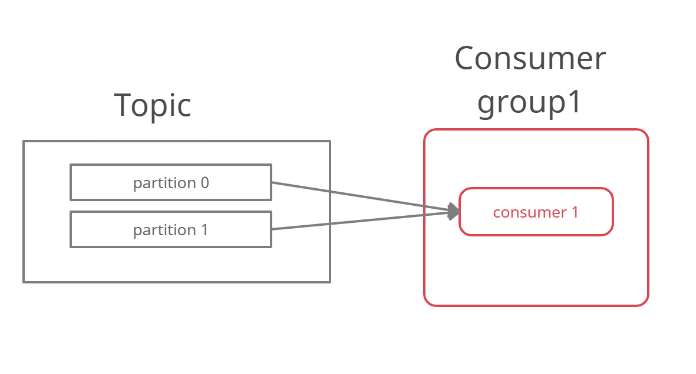
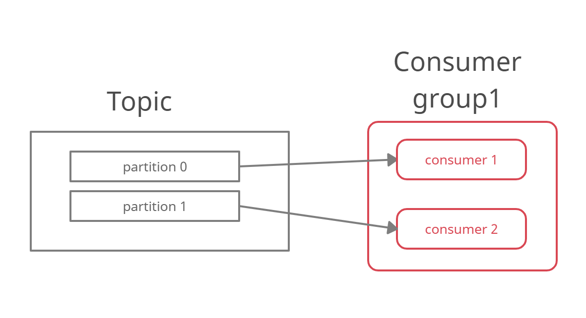
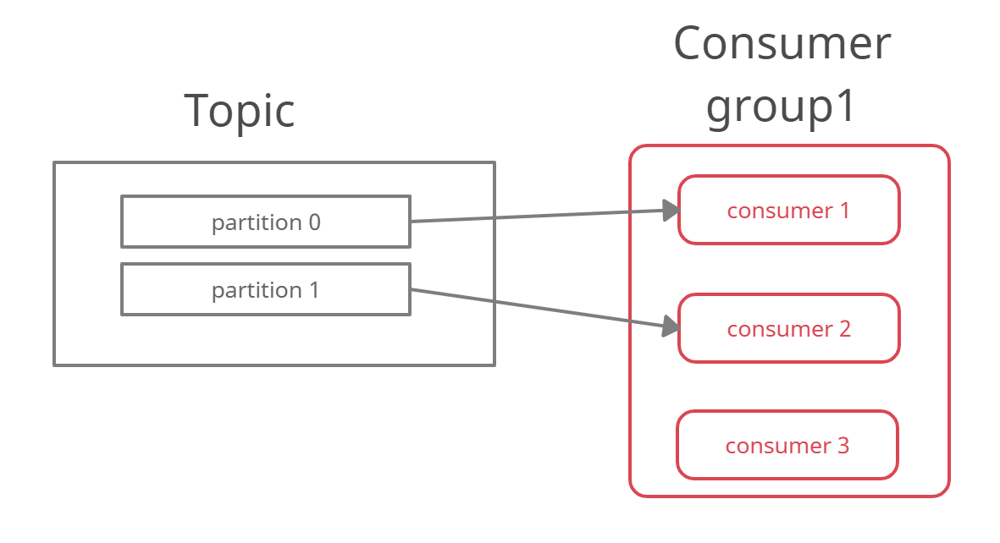
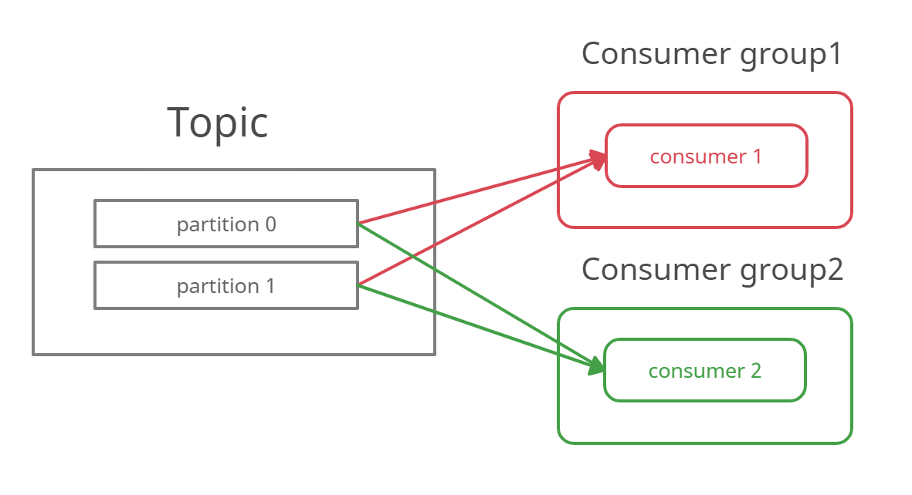
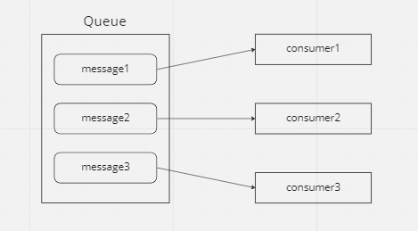
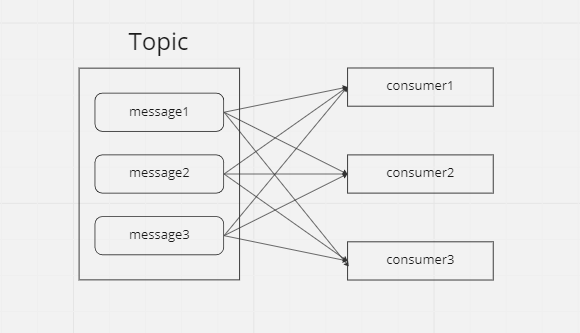
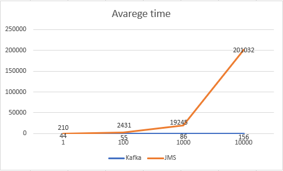

<!-- Improved compatibility of back to top link: See: https://github.com/othneildrew/Best-README-Template/pull/73 -->
<a name="readme-top"></a>

<!-- PROJECT LOGO -->
<br />
<div align="center">
  <a href="https://github.com/github_username/repo_name">
    
  </a>

<h1 align="center">Apache Kafka VS Java Message System(JMS)</h1>

  <p align="center">
    This document is about the analyse of tool Apache Kafka event streaming platform and comparison with regular java message service JMS.
<!--    
<br />
    <a href="https://github.com/github_username/repo_name"><strong>Explore the docs »</strong></a>
    <br />
    <br />
    <a href="https://github.com/github_username/repo_name">View Demo</a>
    ·
    <a href="https://github.com/github_username/repo_name/issues">Report Bug</a>
    ·
    <a href="https://github.com/github_username/repo_name/issues">Request Feature</a>
-->  
</p>
</div>


<!-- TABLE OF CONTENTS -->
<details>
  <summary>Table of Contents</summary>
  <ol>
    <li>
      <a href="#Kafka Vs. JMS">Kafka Vs. JMS</a>
      <ul>
        <li><a href="#Kafka Vs. JMS">Kafka Vs. JMS</a></li>
      </ul>
    </li>
    <li><a href="#contact">Contact</a></li>
  </ol>
</details>


<!-- ABOUT THE PROJECT -->
## About The Project
This Document is about to get more knowledge of Apache Kafka and JMS tool and how they are usable for capturing data in real-time 
event sources. In this document we define the problems and its solution in regular JMS and resolving the same problem with
Apache Kafka. 

Most of the examples has it own implementation in Java and all implementation you can find [here.](seniorprogram)
The Kafka and JMS(ActiveMQ) we dockerized and how you run it you find [here.](set-up-README.md)

The conclusion of comparison can be guide for choosing Kafka to implement event streaming platform in some projects. 

<p align="right">(<a href="#readme-top">back to top</a>)</p>

<!-- GETTING STARTED -->
## Getting Started

Apache Kafka and JMS are the most popular open source application used for messaging projects.
They both handle how to exchange event data, such as application logs, metrics and messages. Characteristic features for
Apache Kafka are low latency publish subscribe messaging system witch can efficiently handle large amounts of data.
The JMS is a Java-based API and the first enterprise-level
messaging API that gained widespread traction in the Information Technology industry. It is a messaging standard containing
Java components that are designed to exchange messages.

# General examples of using Kafka and JMS
This section shows what Kafka and JMS are in general and in witch industies they are used. 
Many systems use remote procedure calls witch are synchronous- producer have to block process and wait until the called 
method finish, and thus is problem in development enterprise applications. Here the message oriented systems provide grate
solution for asynchronous problem. They are based on asynchronous structure and provide message delivery across multiple systems. 
In generaly both have similar structure:

- handling connections and session
- have producers and consumers
- sending and recieving messages

## JMS

Implementation of JMS and its usage can be in many ways. It can be implemented across applications, programing laguages
and technologies.The JMS is grate solution for implementation fot systems witch want to comunicate or send messages between
a destination.


Tha Java Message Service was design to develop business applications witch asynchronously exchange business data and events. It defines API witch is easily and efficiently supported to pass messages from one end-point to another. 
JMS support
messaging models like point-to-point(queuing) and publish-subscribe.

- Point-to-Point (Queue destination): In this model, a message is delivered from a producer to one consumer. The messages are delivered to the destination, which is a queue, and then delivered to one of the consumers registered for the queue. While any number of producers can send messages to the queue, each message is guaranteed to be delivered, and consumed by one consumer. If no consumers are registered to consume the messages, the queue holds them until a consumer registers to consume them.


- Publish/Subscribe (Topic destination): In this model, a message is delivered from a producer to any number of consumers. Messages are delivered to the topic destination, and then to all active consumers who have subscribed to the topic. In addition, any number of producers can send messages to a topic destination, and each message can be delivered to any number of subscribers. If there are no consumers registered, the topic destination doesn't hold messages unless it has durable subscription for inactive consumers. A durable subscription represents a consumer registered with the topic destination that can be inactive at the time the messages are sent to the topic.


So JMS can be used as a mechanism to allow asynchronous request processing. 
One reason to use is not to wait to finish the call or multiple consumers want to consume same request.
Another reason is to alow multiple applications to access information via JMS.
A real world example can be used application witch use to place order for a particular customer. Part of placing that order application want to store the order on third party system or send an email to the customer to inform that order has been made.

To do this application would publish a message onto a JMS queue which includes an oreder identifier. One part of application can listen to the queue and respond to the event by take order identifier and look up in the database. Then place order with third party system, another part of application may responsible for taking the order from the queue and send the confirmation email to the customer.

### Conclusion

JMS can be use as message broker where 2 or more services want to communicate. This could be point to point or pub-sub mode
as explained in the above. With JMS, producer can produce messages to an queue/topic and not worry about consumer being up. 
JMS buffers these messages and delivers them once the consumer is up. 

## Kafka

Kafka is a event distributed streaming platform. Lot of different applications like web applications, mobile applications,
and web server logs are writing logs or embedding data. So there can be ‘n’ number of applications witch want to exchange or collect
data. Kafka can handle and store all this data in a very efficient manner.

Kafka combines three key capabilities so you can implement your use cases for event streaming end-to-end with a single battle-tested solution:

1. to Publish/Subscribe streams of events, including continuous import/export of your data from other systems.

2. to store streams of events durably and reliably for as long as you want.
3. to process streams of events as they occur or retrospectively.


The Apache Kafka is regular used for:

- Metrics − used for operational monitoring data. This involves aggregating statistics from distributed applications to produce centralized feeds of operational data.

- Log Aggregation Solution − across an organization to collect logs from multiple services and make them available in a standard format to multiple consumers.

- Stream Processing − read data from a topic, process it, and write processed data to a new topic where it becomes available for users and applications.
  Apache Kafka’s strong durability is also very useful in the context of stream processing.
  

A real example of using Kafka can be Website activity tracking application. User can visit on webpage and perform any action
like search, login, click on a product etc and all of these events the application will capture.
Tracking event will create when user perform any action and message stream for this based on the kind of event 
it will process and store to a specific topic by Kafka Producer.
This kind of activity tracking often requires a very high volume of throughput,
messages are generated for each action.


Companies witch use Kafka

- The New York Times uses Apache Kafka and the Kafka Streams to store and distribute, in real-time, published content to the various applications and systems that make it available to the readers.


## Kafka Vs. JMS

Introduction to the Kafka and Jms provide good examples why many times is preferable to use Kafka then JMS.
General usage of Kafka architecture described above, shows that Kafka is a near real-time data streaming solution. Therefore, it is useful for systems such as financial processing, IoT, and real-time maintenance solutions.

JMS can be place in group of not real-time, despite its message processing is asynchronous.  JMS also uses the imperative programming paradigm, which can be substantially slower than the Apache Kafka method.

<p align="right">(<a href="#readme-top">back to top</a>)</p>

# Kafka Configuration

## Intro
In this section is high-level overview of Apache Kafka configuration and snippets witch should help to understand basic configuration.

### In Spring Boot
#### Configuration dependency
In Spring Boot the easiest way to implement Kafka is in maven dependency build toll declare:
```xml
<dependency>
    <groupId>org.springframework.kafka</groupId>
    <artifactId>spring-kafka</artifactId>
</dependency>
```
For the minimal consumer application is needed to implement:

```java
import org.springframework.kafka.annotation.KafkaListener;

@SpringBootApplication
public class Application {

    public static void main(String[] args) {
        SpringApplication.run(Application.class, args);
    }

    @Bean
    public NewTopic topic() {
        return TopicBuilder.name("topic1")
                .partitions(1)
                .replicas(1)
                .build();
    }

    @KafkaListener(id = "id", topics = "topic1")
    public void listen(String in) {
        //business logic 
        System.out.println(in);
    }

}
```
For the minimal producer application is needed to implement:

```java
@SpringBootApplication
public class Application {

    public static void main(String[] args) {
        SpringApplication.run(Application.class, args);
    }

    @Bean
    public NewTopic topic() {
        return TopicBuilder.name("topic1")
                .partitions(1)
                .replicas(1)
                .build();
    }

    @Bean
    public ApplicationRunner runner(KafkaTemplate<String, String> template) {
        return args -> {
            template.send("topic1", "test");
        };
    }

}
```
### Without Spring Boot
Now lets see the same simple implementation without use Spring Boot.
#### Configuration dependency
Spring Boot automatically declare the correct version which is compatible with your Boot version. 
If we are not using Spring Boot, declare the kafka jar as a dependency:
```xml
<dependency>
    <groupId>org.springframework.kafka</groupId>
    <artifactId>spring-kafka</artifactId>
    <version>2.9.1</version>
</dependency>
```

```java
public class Sender {

	public static void main(String[] args) {
		AnnotationConfigApplicationContext context = new AnnotationConfigApplicationContext(Config.class);
		context.getBean(Sender.class).send("test message", 1);
	}

	private final KafkaTemplate<Integer, String> template;

	public Sender(KafkaTemplate<Integer, String> template) {
		this.template = template;
	}

	public void send(String toSend, int key) {
		this.template.send("topic1", key, toSend);
	}

}

public class Listener {

    @KafkaListener(id = "listener1", topics = "topic1")
    public void listener1(String in) {
        //business logic 
        System.out.println(in);
    }

}

@Configuration
@EnableKafka
public class Config {

    @Bean
    ConcurrentKafkaListenerContainerFactory<Integer, String>
                        kafkaListenerContainerFactory(ConsumerFactory<Integer, String> consumerFactory) {
        ConcurrentKafkaListenerContainerFactory<Integer, String> factory =
                                new ConcurrentKafkaListenerContainerFactory<>();
        factory.setConsumerFactory(consumerFactory);
        return factory;
    }

    @Bean
    public ConsumerFactory<Integer, String> consumerFactory() {
        return new DefaultKafkaConsumerFactory<>(consumerProps());
    }

    private Map<String, Object> consumerProps() {
        Map<String, Object> props = new HashMap<>();
        props.put(ConsumerConfig.BOOTSTRAP_SERVERS_CONFIG, "localhost:9092");
        props.put(ConsumerConfig.GROUP_ID_CONFIG, "group1");
        props.put(ConsumerConfig.KEY_DESERIALIZER_CLASS_CONFIG, IntegerDeserializer.class);
        props.put(ConsumerConfig.VALUE_DESERIALIZER_CLASS_CONFIG, StringDeserializer.class);
        props.put(ConsumerConfig.AUTO_OFFSET_RESET_CONFIG, "earliest");
        // ...
        return props;
    }

    @Bean
    public Sender sender(KafkaTemplate<Integer, String> template) {
        return new Sender(template);
    }

    @Bean
    public Listener listener() {
        return new Listener();
    }

    @Bean
    public ProducerFactory<Integer, String> producerFactory() {
        return new DefaultKafkaProducerFactory<>(senderProps());
    }

    private Map<String, Object> senderProps() {
        Map<String, Object> props = new HashMap<>();
        props.put(ProducerConfig.BOOTSTRAP_SERVERS_CONFIG, "localhost:9092");
        props.put(ProducerConfig.LINGER_MS_CONFIG, 10);
        props.put(ProducerConfig.KEY_SERIALIZER_CLASS_CONFIG, IntegerSerializer.class);
        props.put(ProducerConfig.VALUE_SERIALIZER_CLASS_CONFIG, StringSerializer.class);
        //...
        return props;
    }

    @Bean
    public KafkaTemplate<Integer, String> kafkaTemplate(ProducerFactory<Integer, String> producerFactory) {
        return new KafkaTemplate<Integer, String>(producerFactory);
    }

}
```

As the example shows, that without Spring Boot is need to be defined several infrastructure beans

### Without Spring
Now lets see simple usage of Kafka consumer without using Spring.

```java
        Properties props=new Properties();
        props.setProperty("bootstrap.servers","localhost:9092");
        props.setProperty("group.id","group1");
        props.setProperty("enable.auto.commit","true");
        props.setProperty("auto.commit.interval.ms","1000");
        props.setProperty("key.deserializer","org.apache.kafka.common.serialization.StringDeserializer");
        props.setProperty("value.deserializer","org.apache.kafka.common.serialization.StringDeserializer");
        
        KafkaConsumer<String, String> consumer=new KafkaConsumer<>(props);
        consumer.subscribe(Arrays.asList("topic1","topic2"));
        while(true){
          ConsumerRecords<String, String> records=consumer.poll(Duration.ofMillis(100));
          for(ConsumerRecord<String, String> record:records){
                System.out.printf("offset = %s, key = %s, value = %s",record.offset(),record.key(),record.value());
          }   
        }

```
Setting enable.auto.commit means that offsets are committed automatically with a frequency controlled by the config auto.commit.interval.ms.

In this example the consumer is subscribing to the topics topic1 and topic2 as part of a group of consumers called group1 as configured with group.id.

The deserializer settings specify how to turn bytes into objects. For example, by specifying string deserializers, we are saying that our record's key and value will just be simple strings.

# JMS Configuration

For JMS confuguration

### In Spring Boot
```java
@Configuration
@EnableJms
public class JmsConfig {

    @Bean
    public JmsListenerContainerFactory<?> jmsListenerContainerFactory() {
        DefaultJmsListenerContainerFactory factory = new DefaultJmsListenerContainerFactory();
        factory.setConnectionFactory(connectionFactory());
        return factory;
    }

    @Bean
    public ConnectionFactory connectionFactory() {
        return new ActiveMQConnectionFactory("tcp://localhost:61616");
    }

    @Bean
    public JmsTemplate jmsTemplate() {
        return new JmsTemplate(connectionFactory());
    }
}
```
For the minimal consumer application is needed to implement:
```java
@Component
public class JmsMessageProducer {
    
    private JmsTemplate jmsTemplate;

    public void setJmsTemplate(JmsTemplate jmsTemplate) {
        this.jmsTemplate = jmsTemplate;
    }

    public void sendMessage(final Object message) {
        this.jmsTemplate.convertAndSend(message);
    }
}
```
For the minimal consumer application is needed to implement:

```java
@Component
public class JmsMessageListener {

    private static final Logger logger = LoggerFactory.getLogger(JmsMessageListener.class);

    @JmsListener(destination = "queue-1")
    public void sampleJmsListenerMethod(TextMessage message) throws JMSException {
        logger.info(String.format("----Listener1 Received text message: %s ---------", message.getText()));
    }
}
```

# Consumer groups in Kafka

As we mention above, Apache Kafka have typically two-way to use messaging system:

- send a message to targeted group of consumers which can be just one consumer
- broadcast the message to all the consumers.
For achieving both Kafka use consumer groups.
  
## Consumer group
Consumer group is grouping consumers together by group id. When a topic is consumed by consumers in the same
group it granted that every record will be consumed only in one consumer. The records will be effeciently load-balanced
over the consumer instances.

This ensures parallel processing of data where consumers are never getting involved in processing same record.

Mentioned above Kafka have topic witch consist at least one or more partitions. Kafka ensure that consumer process only one
partition in group.


Let see on chart if topic have two partitions and only one consumer in a group, the consumer will process data from both partitions.


If same topic have two consumers with same consumer group id, each consumer will process data from only one partition.


If same topic have more than one consumer with same group id and read from one topic, then topic need to have more than one
partition. If not extra consumer will stay inactive.


The real advantages of consumer groups is when multiple consumers want process same data. If each consumer have different
group id, it can consume same records from one topic.

### How it is implemented in code?

```java
@Component
public class KafkaMessageListener {
    @KafkaListener(topics = "topic1", containerFactory = "group1KafkaListenerContainerFactory")
    public void listenGroup1(String message) {
      System.out.println("Received Message in group1 listener: " + message);
      this.g1Latch.countDown();
    }
  
    @KafkaListener(topics = "topic1", containerFactory = "group2KafkaListenerContainerFactory")
    public void listenGroup2(String message) {
      System.out.println("Received Message in group2 listener: " + message);
      this.g2Latch.countDown();
    }
}
```
See the functional [example](https://github.com/TomasKo/seniorprogram/tree/develop/src/main/java/seniorprogram/groups/kafka) 


# Topics in JMS
This chapter is about how topic are use in JMS and how similar is to ques in Kafka.

Jms have queue and topic. Consumer in a queue never receive the same message, each message consume only one consumer as shown in the example.


Topis in JMS are used to broadcast messages, one message is delivere to all consumers.



## How it is implement?
To sending or recieving data from topics is basicaly configuration issue when is JMS factory initialized. 
For the consumer is need to set up setPubSubDomain to true in jms listener container factory and for producer i set up same
configuration in jms template. Example of configuration: 

```java
public JmsListenerContainerFactory<?> jmsListenerContainerFactory() {
    DefaultJmsListenerContainerFactory factory = new DefaultJmsListenerContainerFactory();
    factory.setConnectionFactory(connectionFactory());
    factory.setPubSubDomain(true);
    return factory;
}

public JmsTemplate jmsTemplate() {
    JmsTemplate jmsTemplate= new JmsTemplate(connectionFactory());
    jmsTemplate.setPubSubDomain(true);
    return jmsTemplate;
}
```


<p align="right">(<a href="#readme-top">back to top</a>)</p>

#Performance

In general Kafka is distributed streaming platform witch offers also horizontal scalability
and high throughput. For real time data processing is pickup Kafka over JMS more common.
Kafka is way faster than JMS and it can handle millions of messages per second.

In this part we implement small performance test where we show the differences in processing. 
We implement producers witch only send messages to show the difference.

In the example we send 1, 100, 1000 and 10000 of messages several times and in the end we avarage the 
result witch shows the chart 



 
Average JMS send count:1 time spend:210  
Average Kafka send count:1 time spend:44

Average JMS send count:100 time spend:2431  
Average Kafka send count:100 time spend:55  

Average JMS send count:1000 time spend:19245  
Average Kafka send count:1000 time spend:86  

Average JMS send count:10000 time spend:203357  
Average Kafka send count:10000 time spend:156

As show the result from example above we can prove that Kafka is more effecient in processing the messages.

<p align="right">(<a href="#readme-top">back to top</a>)</p>

# Filtering
## JMS Message Selector
For filter the messages in JMS is use message selector. It configures at consumer and it specify witch messages is 
consumer interested in. A selector is an conditional expression witch define rule for filtering.

The message consumer recieves only messages whose properties match the selector. Let it show on example:

For the implementation first producer have to configure to send properties on which consumer will be filtering the messages.
That means for jmsTemplate we need to add string property:

```java
public void sendTextMessageWithProperty(String destination, String message, String property) {
    jmsTemplate.convertAndSend(destination, message,mp-> {
        mp.setStringProperty("myproperty", property);
        return mp;
    });
}
```

Then is really easy for listener to define selector which defined by condition which messages will be consumed.

```java
@JmsListener(destination = "queue-3", selector = "myproperty = 'hight'")
public void sampleJmsListenerMethod2(TextMessage message) throws JMSException {
    logger.info(String.format("----Listener2 Received text message: %s ---------", message.getText()));
}
```
See the functional [example](https://github.com/TomasKo/seniorprogram/tree/develop/src/main/java/seniorprogram/filtering/jms)

<p align="right">(<a href="#readme-top">back to top</a>)</p>

## Kafka filtering

Transformations can be configured with predicates, so the filtering is applied only to records which satisfy a condition.
This predicates are speciefied in the connector configuration and must be declared in listener container factory . Let see on example:

```java
@Bean
public ConcurrentKafkaListenerContainerFactory<String, String> filterKafkaListenerContainerFactory() {
    ConcurrentKafkaListenerContainerFactory<String, String> factory = kafkaListenerContainerFactory("filter");
    factory.setRecordFilterStrategy(record -> record.value().contains("mystring"));
    return factory;
}
```

Kafka have also posibility to filter by using streams. Stream filtering can be used when you want to filter specific 
events from a Kafka topic and write the filtered stream to another Kafka topic.
Let see on example:
```java
public void streamTopology(){
    KStream<String, String> kStream =
            streamsBuilder.stream("topic1", Consumed.with(Serdes.String(), Serdes.String()));
    kStream.filter((key, value) -> value.startsWith("M") )
            .peek((k, v) -> System.out.println("Filtering message:"+v))
            .to("topic2", Produced.with(Serdes.String(), Serdes.String()));
}
```
See the functional [example](https://github.com/TomasKo/seniorprogram/tree/develop/src/main/java/seniorprogram/filtering/kafka)

### Conclusion
Kafka has more otions how to filter the messages than a JMS. In JMS is filtering implement by configuration where it is more
complicated to wrote condition. On the other side in Kafka is esier to wrote condition for filtering via configuration
and also Kafka have posibility to filter via streams witch is modern functional programming.   

<p align="right">(<a href="#readme-top">back to top</a>)</p>

# Ordering

## JMS order of messages
Jms preserve the order of messages on a topic by single producer to all consumer. Single consumer on queue also provide order
when messeges are send by single producer.

If there is more consumers on a single queue the consumers will compete for messages and the order will be lost. The solve this Jms like ActiveMq use:
- [Exclusive consumer](https://activemq.apache.org/exclusive-consumer)  wich allows only a single consumer to consume from the queue at once to preserve order
- [Message groups](https://activemq.apache.org/message-groups) which splits the messages on a queue into parralel virtual queues to ensure that messages to a single message
group will have their order preserved and different groups will be load balanced to different consumers.

## Order guaranetee in Kafka

Ordering with partitioning is most important features of Kafka. With that Kafka do load balancing of messages and garantee
ordering in a cluster, which otherwise would not be possible.
To achieve higher performance for processing the messages aplication implement multiple instances of the consumer application.
To do that Kafka has the concept of partitions within the topics which could provide both ordering garantees and load balancing
over a poll of consumers.

Each partition is an ordered sequence of messages and for the messages are assigned a sequential id called the offset. 
The offset uniquely identifies each message within the partition. Topic than have multiple partitions where each message 
have their own offset. 

To achieve this partitioning, Kafka has 2 ways:
1) Define a Key for partitioning which would be used as a key for default partitioning logic.
2) Write a Partitioning class to define our own partitioning logic.

For ordering we used partition logic. Where is easy to implement send message to partition:
```java
public void sendMessageToPartition(String topic, String message, int partition) {
    kafkaTemplate.send(topic, partition, null, message);
}
```
By that configuration we guarantee that sended message will have correct order in consumer.
See the functional [example](https://github.com/TomasKo/seniorprogram/tree/develop/src/main/java/seniorprogram/ordering/kafka)


<!-- CONTACT -->
## Contact

Tomas Kopernicky - tomas.kopernicky@betterask.erni

Project Link: [https://github.com/TomasKo/seniorprogram](https://github.com/TomasKo/seniorprogram)

<p align="right">(<a href="#readme-top">back to top</a>)</p>


<!-- MARKDOWN LINKS & IMAGES -->
<!-- https://www.markdownguide.org/basic-syntax/#reference-style-links -->
[contributors-shield]: https://img.shields.io/github/contributors/github_username/repo_name.svg?style=for-the-badge
[contributors-url]: https://github.com/github_username/repo_name/graphs/contributors
